<h1 align="center">
  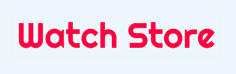
</h1>

### Project description

⌚Watch Store - is an e-commerce website with many features. The project consists of two parts, an interface in React and an API developed in Node.js.
[Access the API repository](https://github.com/renandcr/watch-store-2-api).

<br>


<br>

### Project status 🚀 In production!

<br>

### 🏁 Index

- [⚙️ Features](#️-features)
- [🛠️ Technologies used](#️-technologies-used)
- [🎨 Layout](#-layout)
  - [Home](#home)
  - [Cart](#cart)
  - [Registration](#registration)
  - [Login](#login)
  - [Checkout](#checkout)
  - [My addresses](#my-addresses)
  - [Completed Purchase](#completed-purchase)
  - [My requests](#my-requests)
  - [My account](#my-account)
  - [Privacy policy](#privacy-policy)
- [Quick start](#quick-start)
  - [Learn more](#learn-more)
- [Author](#author)
- [License](#license)

<br>

## ⚙️ Features

1. Register user
2. Change user data
3. Login account
4. Search for products in the search field
5. Add products to cart
6. Remove products from cart
7. Change the individual quantity of the products added to the cart
8. Register address
9. Delete address
10. Change address details
11. Close order
12. Change purchase installment plan
13. Finalize purchase order
14. View completed orders

<br>

## 🛠️ Technologies used

- [React](https://reactjs.org/)
- [Typescript](https://www.typescriptlang.org/)
- [Styled Components](https://styled-components.com/)
- [Redux](https://redux.js.org/)
- [Material Ui](https://mui.com/)
- [Axios](https://axios-http.com/ptbr/)
- [React Router Dom](https://reactrouter.com/en/main)
- [React Hook Form](https://react-hook-form.com/)
- [Yup](https://www.npmjs.com/package/yup)
- [React Toastify](https://fkhadra.github.io/react-toastify/introduction)
- [React Alice Carousel](https://www.npmjs.com/package/react-alice-carousel)
- [Framer Motion](https://www.framer.com/motion/)

<br>

## 🎨 Layout

### Home

Website home page.

<h4>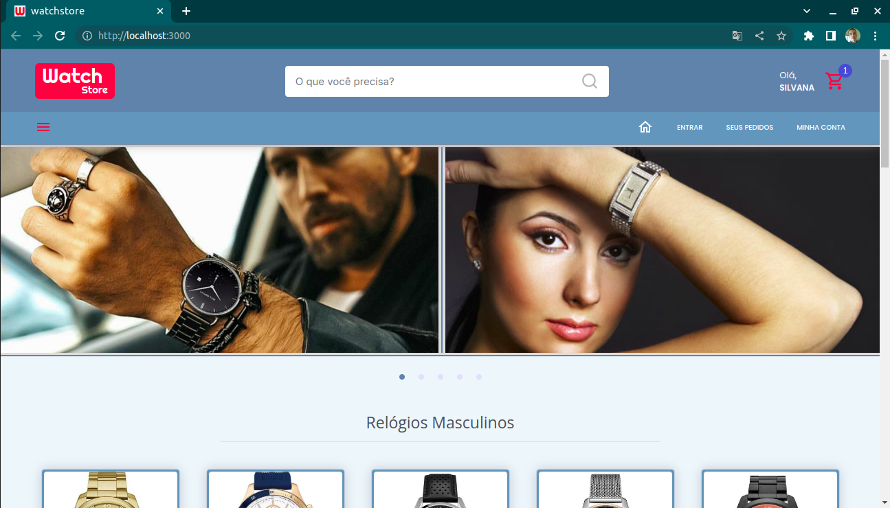</h4>

<br>

Accessing the sidebar menu.

<h4>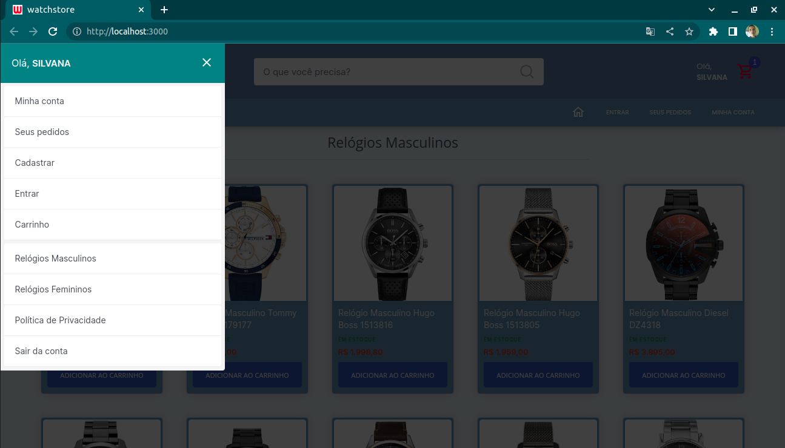</h4>

<br>

Searching for products in the search field.

<h4>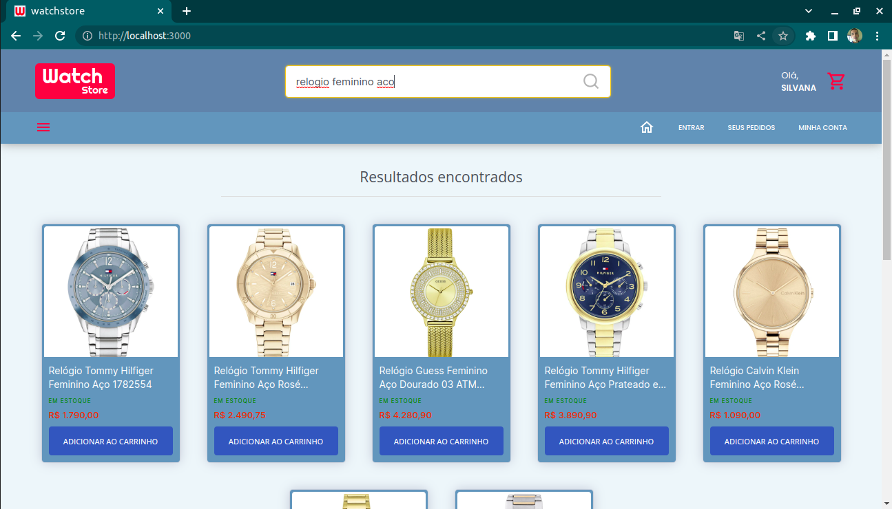</h4>

<br>

Failed search.

<h4>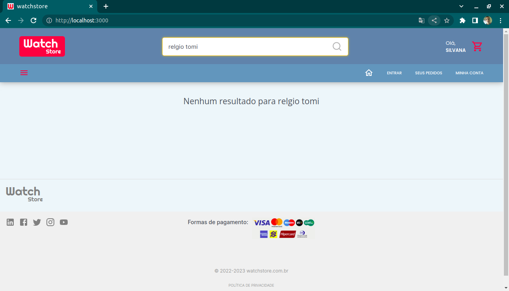</h4>

<br>

On the right side, one of the items is out of stock, so there is no way to add it to the cart.

<h4>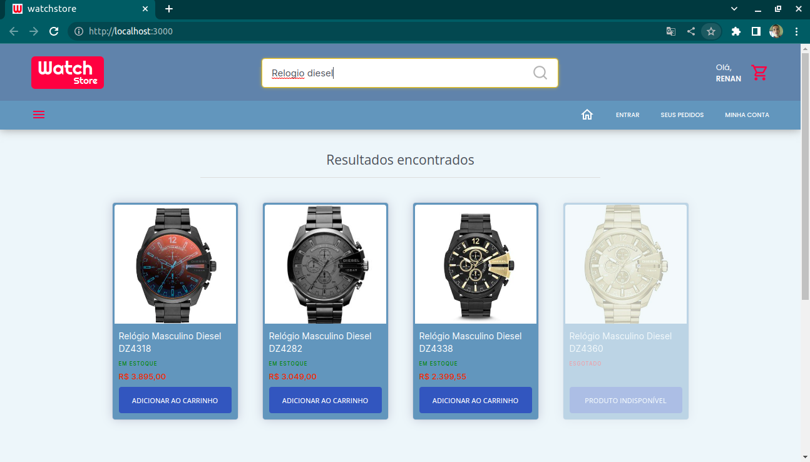</h4>

### Cart

Products added to cart. User can change units or remove product. In the order summary, the user can view the total quantity and total price of all items added to the cart. Once finished, user can close the order.

<h4>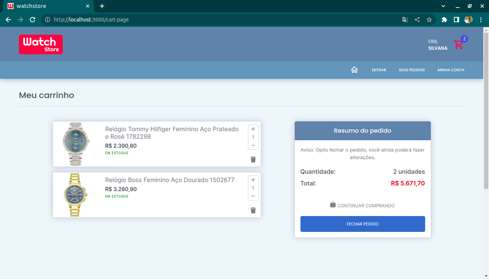</h4>

<br>

When the user tries to close the order but does not yet have a registered address, a modal appears so that he can register a valid address. User needs to be logged in to be able to close the order, if not, he will be directed to the login page.

<h4>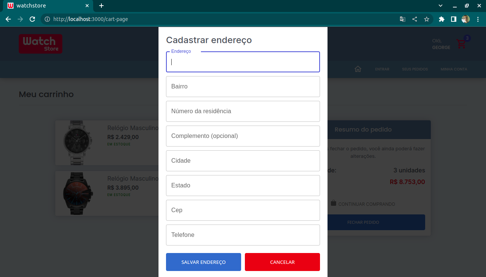</h4>

<br>

Cart has no products added yet.

<h4>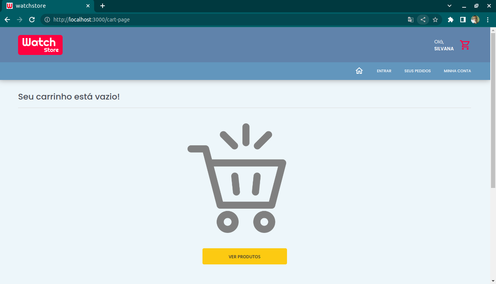</h4>

### Registration

<h4>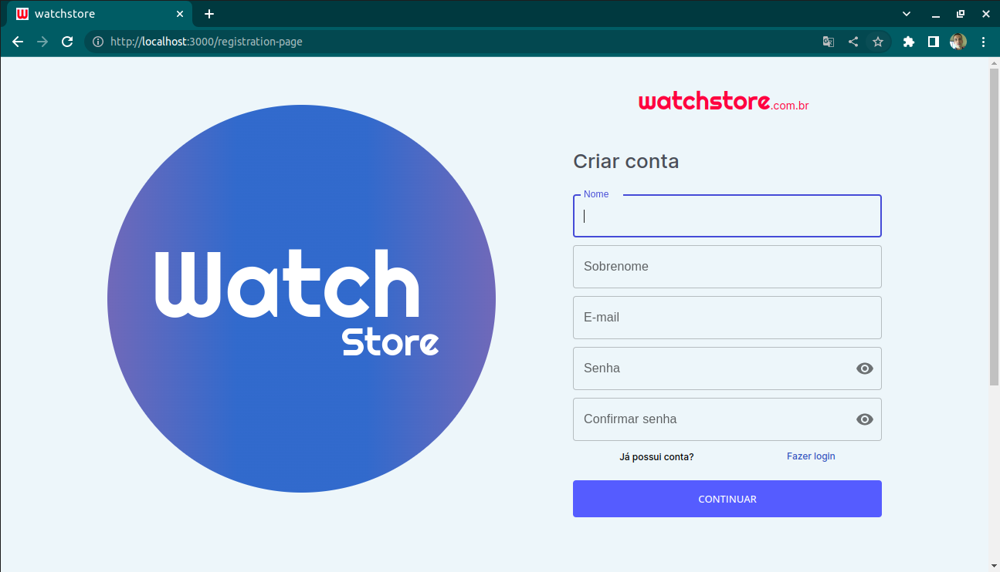</h4>

### Login

<h4>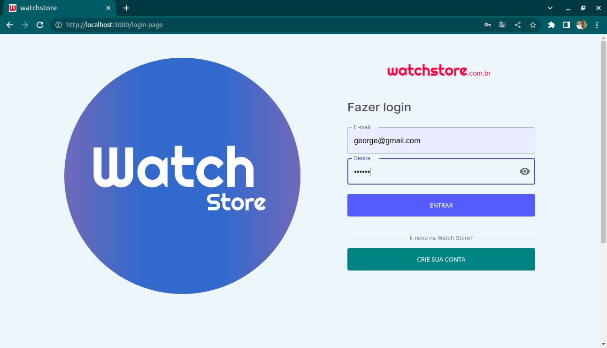</h4>

### Checkout

After the user clicks close the order, he is directed to this page. On this page he can change the delivery address, change the installment plan, change product units or remove a product. After checking everything, the user can complete the purchase.

<h4>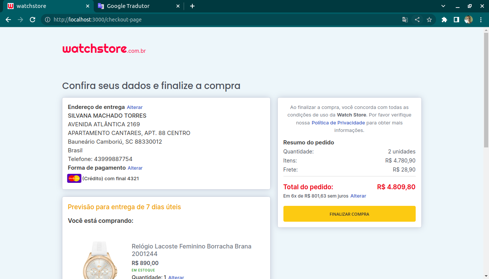</h4>

<br>

Changing installment.

<h4>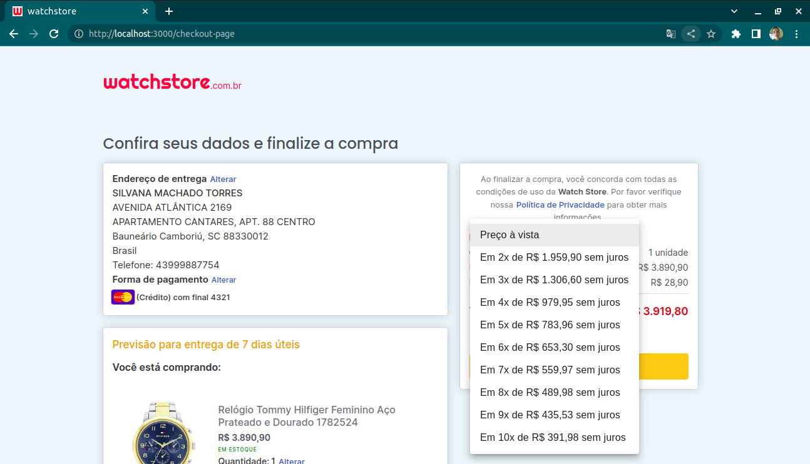</h4>

### My addresses

Here user can remove, edit and add a new address. If the user has more than one address registered, he can select which address he wants the delivery to be made.

<h4>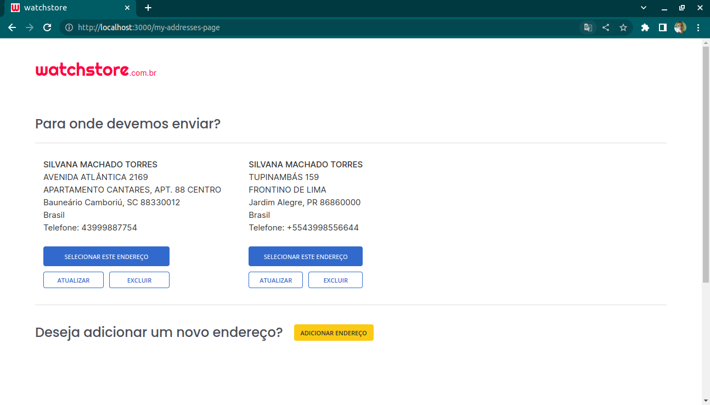</h4>

### Completed Purchase

After completing the purchase, the user is directed to this page.

<h4>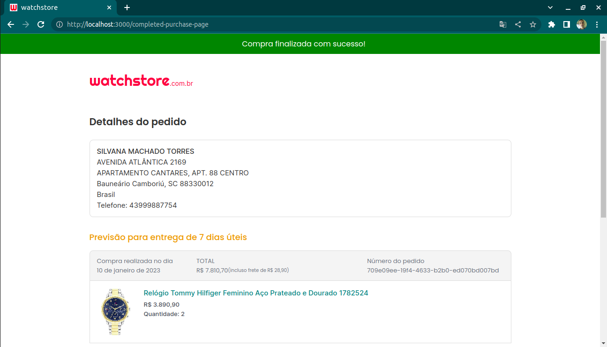</h4>

### My requests

On this page the user can view all of his completed orders.

<h4>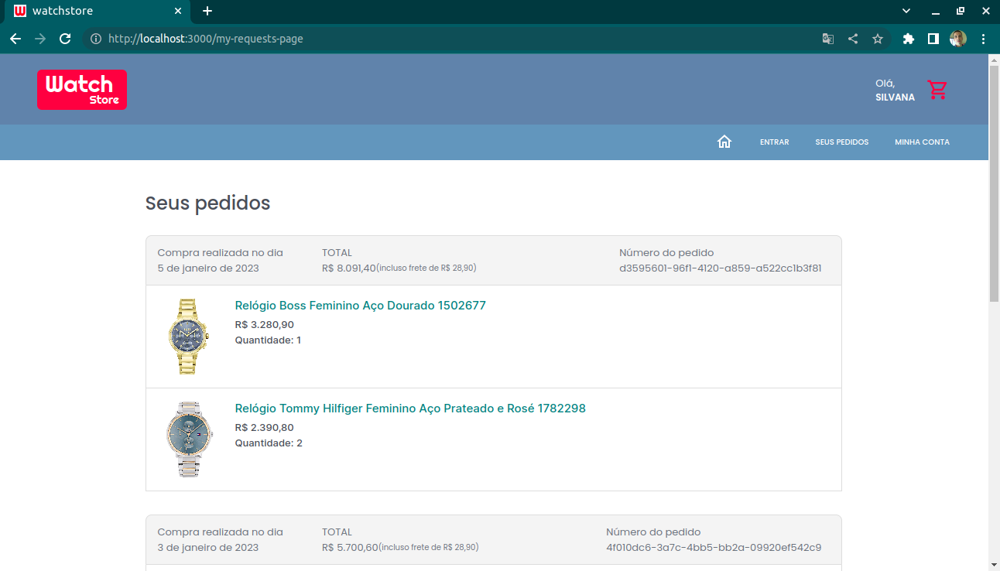</h4>

### My account

Viewing access data.

<h4>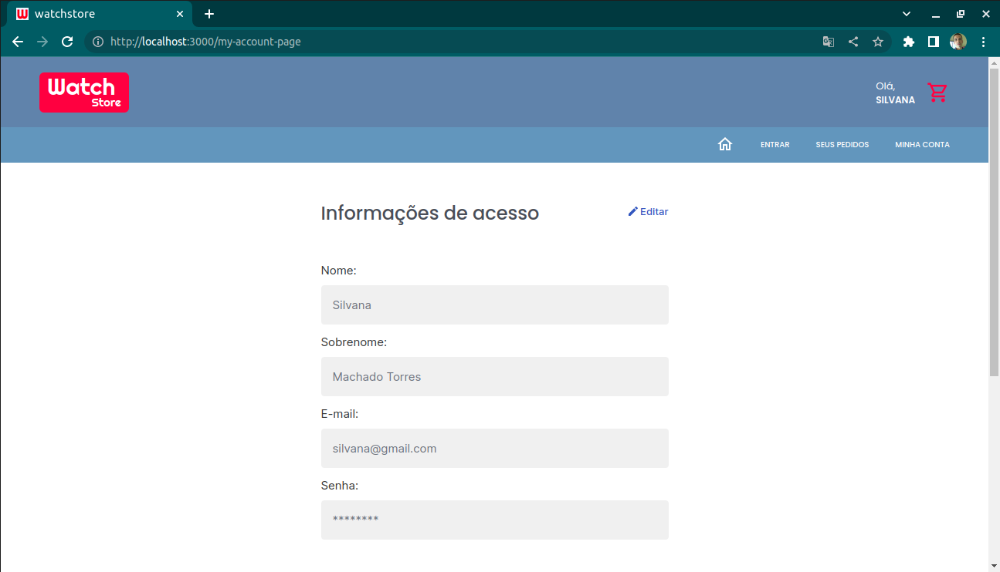</h4>

<br>

Changing access data.

<h4>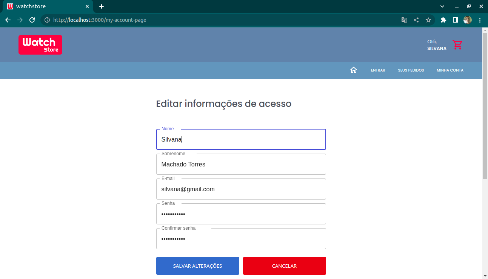</h4>

### Privacy policy

<h4>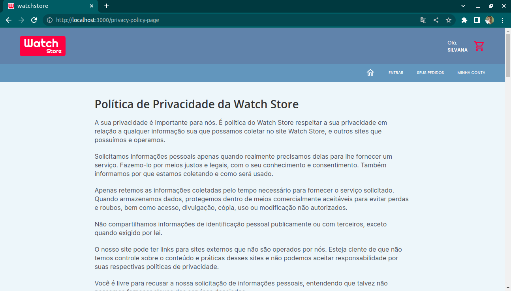</h4>

<br>

<br>

## Quick start

To run a project in React, you will need to have [node.js](https://nodejs.org/en/) installed on your machine. In addition, you will also need a good code editor. My suggestion is the [Visual Studio Code](https://code.visualstudio.com/).

Clone the remote repository on your machine:

```
git@github.com:renandcr/watch-store-design.git
```

<br>

Enter the local repository:

```
cd watch-store-design
```

<br>

Install in your local repository the project dependencies:

```
yarn
```

<br>

Open the text editor in the project's root folder:

```
code .
```

<br>

In your text editor terminal, run the server:

```
yarn start
```

Use "Ctrl + C" to stop the server.

### Learn more

This project was bootstrapped with [Create React App](https://github.com/facebook/create-react-app).

You can learn more in the [Create React App documentation](https://facebook.github.io/create-react-app/docs/getting-started).

<br>

## Author

<h4></h4>
Renan Ribeiro 🚀

<br>

<br>

Made with ❤️ by Renan Ribeiro 👋 Get in touch!

996935385-25D366?style=flat-square&logo=whatsapp&logoColor=white>)

<a href="https://www.linkedin.com/in/renandcr">
</a>

<br>

## License

Licensed under [MIT](https://github.com/renandcr/watch-store-design/blob/developer/LICENSE.md).
